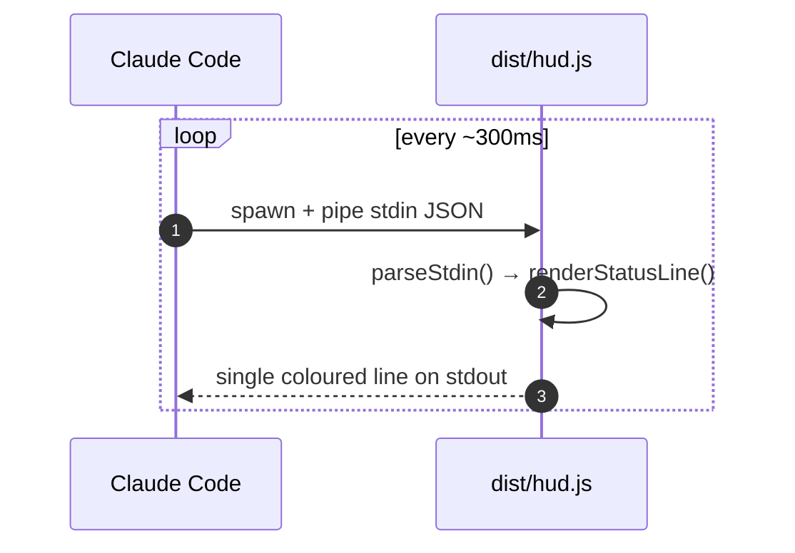
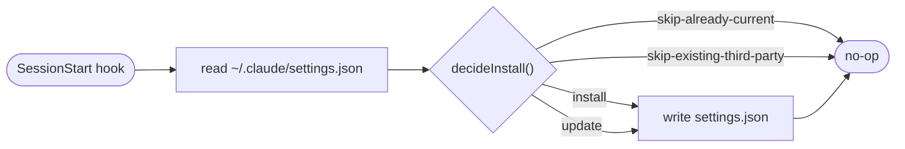

# claude-hud

[](https://github.com/Guiziweb/guiziweb-plugins/actions/workflows/claude-hud-ci.yml)
[](#)
[](../../LICENSE)

> Minimal statusline HUD for Claude Code - shows context usage and rate-limit
> consumption on a single line, with colour escalation when something needs
> your attention.

```text
Context ▰▰▰▰▰▱▱▱▱▱▱▱ 42%  │  5h ▰▰▰▰▱▱▱▱▱▱▱▱ 30% (3h 12m)  ·  7d ▰▱▱▱▱▱▱▱▱▱▱▱ 12% (5d 3h)
```

- **Context** (primary signal): full-colour scale - green / yellow / red.
- **5h, 7d** (rate limits, subscriber plans only): dim grey when calm, yellow at 70%, red at 85%.
- **Reset suffix** appended in dim - `(3h 12m)` until the bucket resets.
- The limits group is omitted entirely when `rate_limits` is absent from stdin
  (API-only users, older Claude Code versions).

## How it works

### Runtime loop (statusline)



`dist/hud.js` is the statusline command Claude Code spawns each tick. It parses
the stdin payload with a defensive Valibot schema and emits a single coloured
line. Unknown fields are dropped; invalid JSON yields an empty line so the
HUD never shows stale data.

### Install lifecycle (one-shot per session)



`dist/install-statusline.js` runs once per session via the `SessionStart`
hook. It writes (or updates) the user's `~/.claude/settings.json` so that
`statusLine.command` points at the freshly resolved `${CLAUDE_PLUGIN_ROOT}`.
Never overrides a third-party statusLine.

## Project layout

```
plugins/claude-hud/
├── .claude-plugin/plugin.json
├── hooks/hooks.json              # SessionStart → install-statusline
├── src/
│   ├── colors.ts                 # ANSI helpers + threshold constants
│   ├── stdin-schema.ts           # Valibot schema + parseStdin()
│   ├── compute.ts                # context %, clamp, reset-time formatter
│   ├── render.ts                 # bar + assembled status line
│   ├── install.ts                # pure decideInstall() logic
│   ├── hud.ts                    # entry: stdin → render → stdout
│   └── install-statusline.ts     # entry: env + fs → decideInstall → fs
├── tests/                        # bun test, 100% line coverage
├── dist/                         # built JS (committed; consumers run as-is)
├── package.json
├── tsconfig.json
├── tsdown.config.ts
├── biome.json
└── bunfig.toml
```

## Local development

This plugin lives inside the [`guiziweb-plugins`](../../README.md) marketplace
repo. To test the plugin without installing it through the marketplace, point
Claude Code at the plugin directory directly:

```bash
claude --plugin-dir /path/to/guiziweb-plugins/plugins/claude-hud/
```

The first launch runs the `SessionStart` hook, which writes the statusLine
into your `~/.claude/settings.json`. You'll see a log line and need to restart
Claude Code once - subsequent launches show the HUD immediately.

To uninstall, delete the `statusLine` entry from `~/.claude/settings.json`.

## Scripts

```bash
bun install         # one-time setup

bun run check       # biome lint + format check
bun run typecheck   # tsc --noEmit
bun test            # bun:test suite
bun test --coverage # enforced 100% line coverage (see bunfig.toml)
bun run build       # tsdown → dist/hud.js + dist/install-statusline.js
bun run ci          # everything above, in order
```

`dist/` is committed: marketplaces clone the repo as-is, so the build output
must be present without an install step. The CI workflow verifies `dist/` is
in sync with `src/` on every push.

## Architecture notes

- **Pure core, thin entries.** `compute.ts`, `render.ts`, `install.ts` and
  `stdin-schema.ts` are all pure functions of their inputs. `hud.ts` and
  `install-statusline.ts` are tiny wrappers that handle I/O. Coverage applies
  only to the pure modules; the entry points are excluded in `bunfig.toml`.
- **Defensive schema.** Every field on the Claude Code stdin payload is
  optional, so a future Anthropic schema change degrades gracefully instead
  of crashing the statusline.
- **Visual hierarchy.** Context is the user's primary signal, so it stays
  coloured at all times. Limits stay `DIM` until they cross 70% - the bar
  exists on screen but recedes visually when nothing needs your attention.
- **Idempotent install.** `decideInstall` returns one of four explicit
  outcomes (`install`, `update`, `skip-already-current`,
  `skip-existing-third-party`), making the hook safe to fire on every
  session start.
